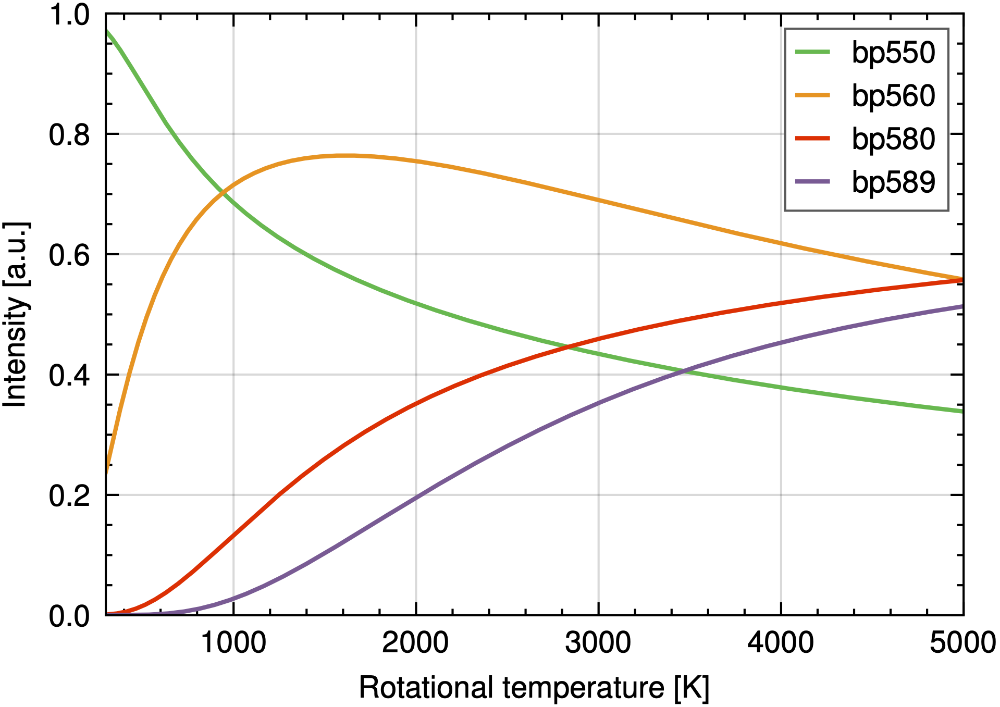

# wedme-plots: We Don't Make Embarrassing Plots

Matplotlib styles for papers, posters and presentations. 

## Styling
We applied a clean style. The figure sizes and font sizes of the `paper` style are compatible with Elsevier journals. The `slides` style is compatible with a Microsoft Powerpoint presentation. `poster` (not implemented yet) is compatible with A0 posters.

## Usage
Import the `wedme` module and apply the desired style:

```python
import wedme

# For Elsevier-compatible paper styles
wedme.paper()

# For 16:9 Powerpoint slides
wedme.slides()

# For A0 posters (not implemented yet)
wedme.poster()
```

## Sizing
For custom figure sizes, we include reference points for every style:

- Paper
  - `wedme.PAPER_FW` is the full textwidth of an Elsevier journal, 190mm.
  - `wedme.PAPER_CW` is the full columnwidth of an Elsevier journal in two-column layout, 90mm.
- Slide
  - `wedme.SLIDE_FW`, `wedme.SLIDE_HW` and `wedme.SLIDE_TW` represent 100%, 50% and 33% of the width of a Powerpoint Widescreen slide.
  - `wedme.SLIDE_FH`, `wedme.SLIDE_HH` and `wedme.SLIDE_TH` represent 100%, 50% and 33% of the height of a Powerpoint Widescreen slide.

These can be used as follows:
```python
plt.figure(figsize=(wedme.SLIDE_TW, wedme.SLIDE_HH))
```

## Examples

